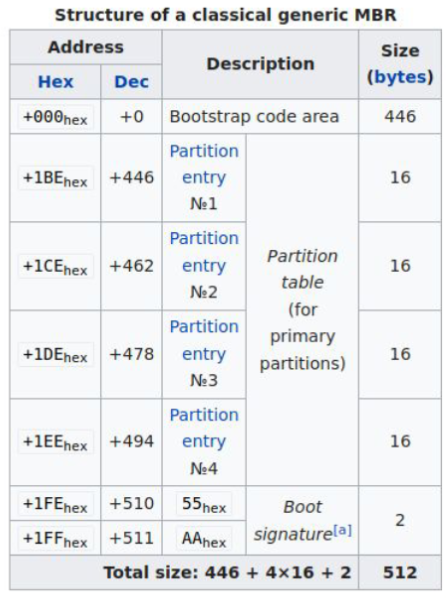
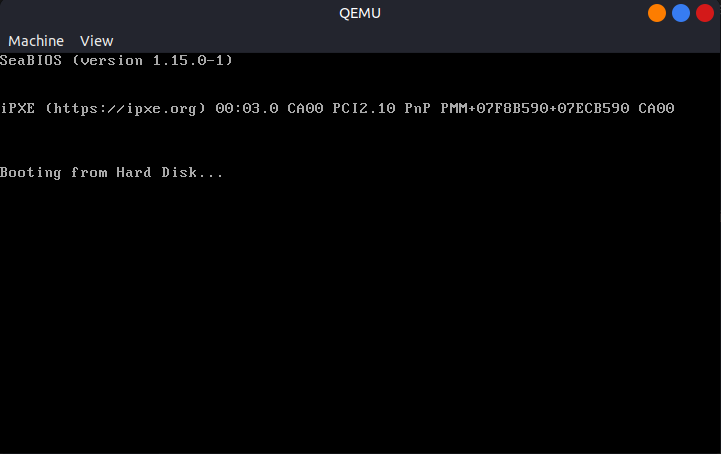
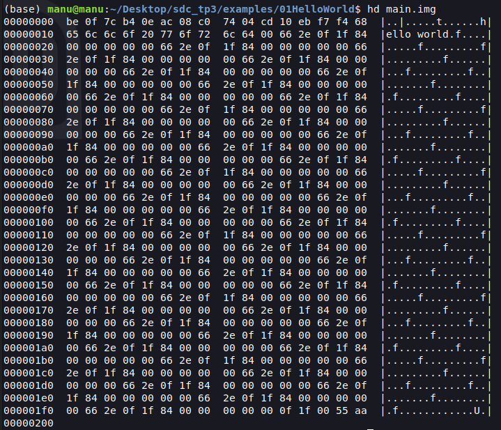
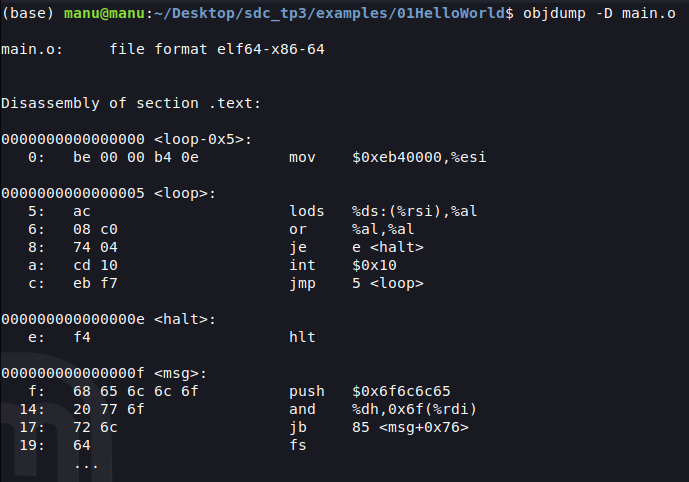
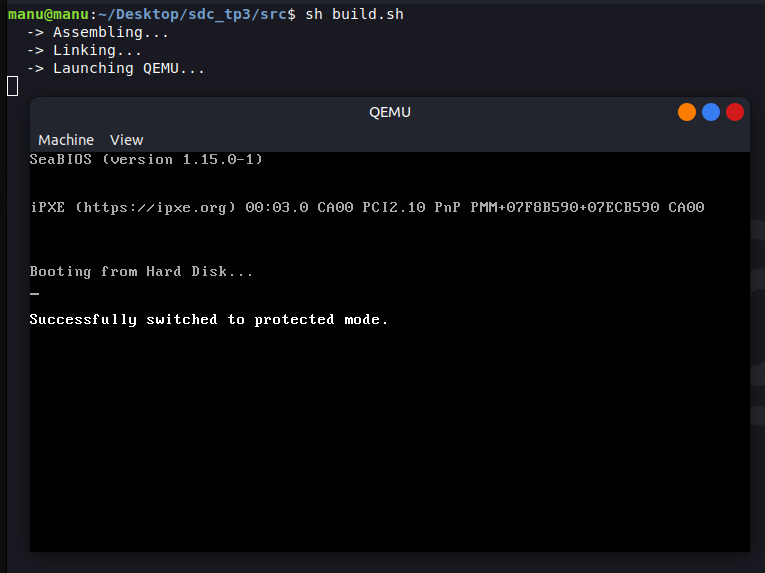
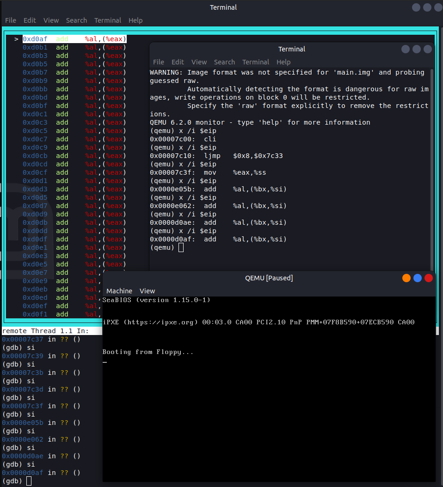

# Sistemas de Computacion
Trabajo Practico 3 - Modo Protegido

**Integrantes:**
- [Gil Cernich, Manuel](https://github.com/manugcr/)
- [Pallardo, Agustin](https://github.com/djpallax)
- [Saporito, Franco](https://github.com/fasaporito)

---

## Objetivo
Los procesadores x86 mantienen compatibilidad con sus antecesores y para agregar nuevas funcionalidades deben ir “evolucionando” en el tiempo durante el proceso de arranque. Todos los CPUs x86 comienzan en modo real en el momento de carga (boot time) para asegurar compatibilidad hacia atrás,  en cuanto se los energiza se comportan  de manera muy primitiva, luego mediante comandos se los hace evolucionar hasta poder obtener la máxima cantidad de prestaciones posibles.

El modo protegido es un modo operacional de los CPUs compatibles x86 de la serie 80286 y posteriores. Este modo es el primer salto evolutivo de los x86. El modo protegido tiene un número de nuevas características diseñadas para mejorar la multitarea y la estabilidad del sistema, tales como la protección de memoria, y soporte de hardware para memoria virtual como también la conmutación de tareas.

**En este TP ejecutaremos un trozo de código que configura nuestro procesador para llevarlo desde el modo real al modo protegido.**

Para ello haremos uso del siguiente [repositorio](https://gitlab.com/sistemas-de-computacion-2021/protected-mode-sdc) que contiene ejemplos de programas a ejecutar, y la imagen necesaria.

Tambien usaremos el repositorio de [x86-bare-metal-examples](https://github.com/cirosantilli/x86-bare-metal-examples).

Ambos repositorios estan clonados dentro de este en la carpeta `examples/`.

---

### UEFI y BIOS
UEFI (Unified Extensible Firmware Interface) y BIOS son dos sistemas de firmware cruciales para la inicialización y configuración de hardware en computadoras. Aunque ambos cumplen la función principal de iniciar el hardware y cargar el sistema operativo, difieren en su arquitectura y funcionalidad. Mientras que el BIOS tradicional opera en un entorno de 16 bits y tiene limitaciones en cuanto a capacidad de direccionamiento y soporte para dispositivos modernos, UEFI ha sido diseñado con una arquitectura de 32 o 64 bits, lo que le permite superar estas limitaciones. UEFI ofrece una interfaz más avanzada y extensible, permitiendo características como la compatibilidad con discos duros de gran capacidad (más de 2 TB), soporte para interfaces de red, arranque seguro (Secure Boot), y una capa de abstracción de hardware (HII) que facilita la interacción con el firmware durante el proceso de inicio. Además, UEFI proporciona una interfaz gráfica de usuario (GUI) más sofisticada para la configuración del sistema, en contraste con la interfaz de texto del BIOS. 

### GPT y MBR
MBR (Master Boot Register) es un esquema de partición heredado utilizado en discos duros y unidades de almacenamiento más antiguas. Está ubicado en el primer sector del disco (sector de arranque) y consta de 512 bytes. MBR contiene una tabla de particiones que describe cómo está dividido el disco en particiones primarias y extendidas. Además, MBR contiene un pequeño código de arranque llamado código de arranque maestro, que se utiliza para iniciar el sistema operativo desde una partición específica del disco. Sin embargo, MBR tiene limitaciones, como la restricción de solo admitir hasta 4 particiones primarias o 3 particiones primarias y 1 extendida.

Por otro lado, GPT (GUID Partition Table) es un estándar más reciente y avanzado para la organización de particiones en discos duros y unidades de almacenamiento. A diferencia de MBR, GPT utiliza una estructura de tabla de particiones más flexible y moderna. Está ubicado al principio del disco y también contiene una copia de respaldo al final del disco para mayor redundancia. GPT permite un mayor número de particiones (hasta 128) y no tiene las limitaciones de tamaño de partición que tiene MBR. Además, GPT proporciona una mayor robustez y resistencia a errores debido a la verificación de integridad de la tabla de particiones y la detección de corrupción de datos.

<p align="center">
  <br>
  <em>Fig 0. MBR structure.</em>
</p>

### Casos de bugs en UEFI
Un caso reciente que deja vulnerable al sistema es el llamado "LogoFAIL". Lo que este hace es, desde el sistema operativo, cambiar la imagen del ordenador que se muestra durante el arranque, por otra que logra acceder a las funciones de carga de la misma. Esto se carga en el firmware UEFI, por lo que un simple formateo o cambio de disco no solucionará el problema. Se podría decir que se un caso de exploit, ya que al tener este acceso, se puede cargar código malicioso y comprometer el equipo.

### Converged Security and Management Engine (CSME)
CSME es una parte crítica del hardware de Intel que proporciona funciones de seguridad y gestión remota en sus procesadores. Una de las características de CSME es el Intel Management Engine BIOS Extension (Intel MEBx), que es una extensión del BIOS que permite a los administradores de sistemas configurar y gestionar remotamente los dispositivos basados en Intel. Esto incluye tareas como la configuración del sistema, la supervisión del hardware y la aplicación de políticas de seguridad.

### Coreboot
Coreboot es un firmware de código abierto diseñado para reemplazar el BIOS tradicional o UEFI en sistemas informáticos. Se caracteriza por ser ligero, rápido y altamente personalizable. Algunos productos que incorporan Coreboot incluyen Chromebooks, algunas computadoras de Google, dispositivos de seguridad y sistemas embebidos. Las ventajas de utilizar Coreboot incluyen un tiempo de arranque más rápido, mayor seguridad debido a su naturaleza de código abierto y la capacidad de personalizar y optimizar el firmware para casos de uso específicos. Además, Coreboot es altamente modular, lo que facilita la depuración y el mantenimiento del firmware en comparación con soluciones propietarias.

---

### Ejemplo ejecucion imagen QEMU
Para ejecutar un programa en modo protegido hacemos uso de QEMU, un emulador de maquinas virtuales. Para instalarlo en Linux hacemos uso de apt:

```bash
$ sudo apt install qemu-system-x86
```

Para el primer programa se crea un sector de arranque y se corre el booteo virtualmente con QEMU, en la arquitectura x86 lo mas simple es crear un sector de arranque de 512 bytes y correrlo con QEMU.

Para ello se crea un archivo de 512 bytes con el siguiente comando:

```bash
$ printf '\364%509s\125\252' > main.img
$ qemu-system-x86_64 --drive file=main.img,format=raw,index=0,media=disk
```

- `\364` es el opcode de `hlt` == `0xf4` en x86.
- `%509s` son 509 espacios hasta el byte 510.
- `\125\252` es la firma de arranque `0x55` y `0xAA`.


<p align="center">
  <br>
  <em>Fig 1. Basic boot example.</em>
</p>

---

### Linker
El linker es una herramienta que se utiliza en el proceso de compilación de programas para combinar múltiples archivos objeto en un solo ejecutable. El linker es responsable de resolver las referencias a símbolos entre los diferentes archivos objeto y generar un archivo ejecutable final que puede ser cargado y ejecutado por el sistema operativo. El linker también es responsable de asignar direcciones de memoria a los diferentes segmentos de código y datos del programa, así como de generar información adicional necesaria para el sistema operativo, como tablas de reubicación y tablas de símbolos.

Para nuestro primer ejemplo de ejecucion en modo protegido vamos a realizar un `hello world`. Para ello hacemos uso de un script de un linker:

```bash
SECTIONS
{
    /* The BIOS loads the code from the disk to this location.
     * We must tell that to the linker so that it can properly
     * calculate the addresses of symbols we might jump to.
     */
    . = 0x7c00;
    .text :
    {
        __start = .;
        *(.text)
        /* Place the magic boot bytes at the end of the first 512 sector. */
        . = 0x1FE;
        SHORT(0xAA55)
    }
}
```
La direccion `0x7C00` en el contexto de sistemas x86, la BIOS carga el sector de arranque (boot sector) del disco en la memoria RAM. Este sector de arranque es el primer sector del disco y contiene el código inicial que se ejecuta al iniciar el sistema. Su tamaño es de 512 bytes, y está ubicado en el sector de arranque del disco.

La dirección `0x1FE` es el byte final del sector de arranque, que tiene una longitud de 512 bytes, esta dirección se utiliza para colocar los "magic boot bytes". Estos "magic boot bytes" consisten típicamente en el valor hexadecimal 0xAA55, que es una firma especial que indica a la BIOS que el dispositivo es un dispositivo de arranque válido.

Si quisieramos ejecutar este `hello world` en un sistema real, deberiamos grabar el archivo en un disco y bootear desde el mismo. Para este caso lo vamos a realizar en QEMU siendo este el codigo a compilar y luego linkear:

```assembly
.code16
    mov $msg, %si
    mov $0x0e, %ah
loop:
    lodsb
    or %al, %al
    jz halt
    int $0x10
    jmp loop
halt:
    hlt
msg:
    .asciz "hello world"
```

Estos tres comandos se emplean para compilar y ejecutar programas en sistemas x86_64. El primero, `as`, ensambla un archivo fuente en lenguaje ensamblador (`main.S`) en un archivo objeto (`main.o`). Luego, `ld` enlaza este archivo objeto para crear un archivo binario (`main.img`). La opción `--oformat binary` en `ld` especifica que el formato de salida del archivo debe ser binario, lo que significa que contendrá una secuencia de bytes sin ningún formato específico de archivo ejecutable. Finalmente, `qemu-system-x86_64` ejecuta el programa contenido en `main.img` en una máquina virtual, tratando este archivo como el disco duro de la máquina virtual.

```bash
$ as -g -o main.o main.S
$ ld --oformat binary -o main.img -T link.ld main.o
$ qemu-system-x86_64 -hda main.img
```

<p align="center">
  <br>
  <em>Fig 2. Hello World example</em>
</p>

Podemos analizar los archivos binarios con `objdump` o `hexdump`, el primero se utiliza para analizar archivos objeto o ejecutables, incluyendo información sobre secciones, símbolos y código ensamblado. El segundo se utiliza para mostrar el contenido de un archivo en formato hexadecimal y ASCII.

<p align="center">
  <br>
  <em>Fig 3. Hexdump of hello world img.</em>
</p>

Sobre este hexdump podemos ver como los primeros bytes `be 0f 7c b4 0e ac 08 c0  74 04 cd 10 eb f7 f4 68` corresponden a las instrucciones en x86 assembly.

- `be 0f 7c` Movemos el valor de 0x7c0f al registro SI.
- `b4 0e` Movemos el valor de 0x0e al registro AH.
- `ac` Lodsb, carga el byte apuntado por SI en AL y aumenta SI.
- `08 c0` Verifica si AL es 0.
- `74 04` Si AL es 0, salta a halt.
- `cd 10` Int 0x10, imprime el valor de AL en pantalla.
- `eb f7` Salta a loop.

El mensaje de `hello world` puede verse en la secuencia de bytes `68 65 6c 6c 6f 20 77 6f 72 6c 64 00`. 

Los últimos dos bytes `55 aa` forman la firma de arranque, indicando que este es un disco de arranque válido.

<p align="center">
  <br>
  <em>Fig 4. objdump of hello world img.</em>
</p>

Utilizando objdump podemos ver que nuestro analisis es correcto y las instrucciones en assembly se corresponden con las instrucciones en el archivo binario. Algo que no podemos ver es que nuestro programa deberia iniciar en la direccion `0x7c00` pero tanto en objdump como en hexdump iniciamos en `0x0`.

---

### Debugging con GDB

Podemos depurar nuestro hello world utilizando gdb en conjunto con QEMU. Para ello ejecutamos el entorno con el siguiente comando, el cual gracias a las flags nos permite conectar gdb a QEMU:

- `-s` Activa GDB stub en el puerto 1234.
- `-S` Inicia QEMU en pausa.
- `-monitor stdio` Permite interactuar con QEMU desde la terminal.

```bash
qemu-system-i386 -fda ../01HelloWorld/main.img -boot a -s -S -monitor stdio
```

Una vez iniciado QEMU, abrimos una nueva terminal y ejecutamos gdb, para linkear nuestro QEMU con gdb primero ejecutamos dentro de gdb el comando `target remote localhost:1234`, luego colocamos breakpoints al inicio del programa y en la direccion de memoria `0x7c00` y al terminar la interrupcion en `0x7c0c` por lo que si ejecutamos paso a paso veremos como la palabra `hello world` se imprime en pantalla caracter por caracter.

<p align="center">
  <br>
  <em>Fig 5. GDB debugging hello world.</em>
</p>

---

### Modo Protegido

El modo real es el estado de funcionamiento inicial de un procesador x86 cuando se enciende. En este modo, el procesador está limitado a un direccionamiento de memoria de 1 MB y no cuenta con protección de memoria ni privilegios de usuario. 

El modo protegido, por otro lado, ofrece un modelo de memoria más avanzado y flexible. En este modo, se permite el direccionamiento lineal de hasta 4 GB de memoria, y se utiliza la paginación para administrar la memoria física de manera más eficiente.

En términos de protección y privilegios, el modo protegido implementa un modelo de protección de memoria robusto. La memoria se organiza en segmentos, y cada segmento tiene atributos de protección que controlan el acceso y los privilegios de escritura o ejecución. Además, se utilizan niveles de privilegio (anillos) para restringir qué partes del sistema pueden realizar ciertas operaciones. Hay cuatro niveles de privilegio, donde 0 es el más privilegiado y 3 es el menos privilegiado.

Los interruptores de modo en el modo protegido son más sofisticados y seguros. Se utilizan instrucciones especiales, como las llamadas de puerta y las interrupciones de puerta, para cambiar de nivel de privilegio de manera controlada y segura. Además, se utiliza un descriptor de tarea para cambiar entre tareas de manera más eficiente y segura, lo que mejora la gestión multitarea y el aislamiento entre procesos.

#### GDT
La GDT es una estructura de datos esencial en arquitecturas x86 utilizada para describir los diferentes segmentos de memoria que puede acceder el procesador. En el contexto del cambio de modo de operación, la GDT es especialmente importante porque define cómo se organiza y administra la memoria en modo protegido.

En este código, la GDT se define como una serie de descriptores, cada uno de los cuales describe un segmento de memoria. Cada descriptor de segmento especifica características importantes, como el límite del segmento, la dirección base, los permisos de acceso y otros atributos.

#### Cambio a modo protegido
El proceso de cambio de modo real a modo protegido consta de varios pasos clave, que se describen a continuación.

Primero, el código deshabilita las interrupciones mediante la instrucción `cli`. Esto asegura que no se interrumpa el proceso de cambio de modo.

Luego, se carga la Tabla de Descriptores Globales (GDT) utilizando la instrucción `lgdt`, que carga la dirección base y el tamaño de la GDT.

Se modifica el registro de control CR0. Aca es donde ocurre el cambio de modo: el bit de habilitación de protección (PE) se establece en 1, lo que indica al procesador que cambie al modo protegido.

Una vez que se ha activado el modo protegido, se realiza un salto a una etiqueta denominada `protected_mode`, que marca el inicio del código en modo protegido.

Dentro de la sección `protected_mode`, se inicializa el puntero de pila (ebp y esp) para asegurar que el programa tenga un espacio de pila adecuado para trabajar en modo protegido y se imprime un mensaje en pantalla si es que se ha logrado el cambio de modo.

En la siguiente imagen podemos ver como se realiza el cambio de modo de operacion de real a protegido. Utilizando el script de linker anteriormente mencionado, se compila y se ejecuta el codigo en QEMU.

```bash
sdc_tp3/src$ sh build.sh
```

<p align="center">
  <br>
  <em>Fig 6. Entering protected mode.</em>
</p>

#### Bits de acceso solo lectura.
Si cambiaramos los bits de acceso del segmento de datos para que sea de solo lectura, intentar escribir en el mismo generaria un problema en la ejecucion del sistema, tal como veremos en la siguiente imagen, la cual queda indefinidamente en la instruccion `add`.         

```assembly
    ; Data descriptor
    gdt_data:
        .word 0xffff                    
        .word 0x0                       
        .byte 0x0       
        ; .byte 0b10010010                            
        .byte 0b10010000                ; Modified to Read Only
        .byte 0b11001111                
        .byte 0x0                       
```

<p align="center">
  <br>
  <em>Fig 7. Read only protected mode.</em>
</p>

---

**1. ¿Cómo sería un programa que tenga dos descriptores de memoria diferentes, uno para cada segmento (código y datos) en espacios de memoria diferenciados?**

(...)

**2. En modo protegido, ¿Con qué valor se cargan los registros de segmento? ¿Porque?** 

En modo protegido, los registros de segmento se cargan con selectores de segmento, que son números de 16 bits que apuntan a entradas en la GDT. Estos selectores no contienen direcciones directas de segmento, sino índices que señalan a descriptores de segmento en la GDT. Esto proporciona flexibilidad y seguridad al permitir la definición de características específicas para cada segmento, como permisos de acceso y nivel de privilegio, y permite la segmentación virtual para gestionar la memoria de manera más eficiente.

```assembly
; Protected mode initialization
.code32
protected_mode:
    ; Initialize the registers and stack pointer
    mov $DATA_SEG, %ax
    mov %ax, %ds
    mov %ax, %es
    mov %ax, %fs
    mov %ax, %gs
    mov %ax, %ss
```
