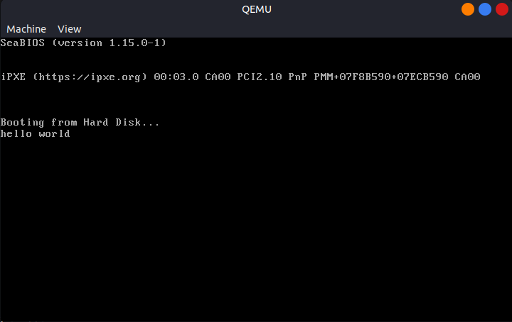

# Sistemas de Computacion
Trabajo Practico 3 - Modo Protegido

- Gil Cernich, Manuel
- Pallardo, Agustin
- Saporito, Franco

---

## Objetivo
Los procesadores x86 mantienen compatibilidad con sus antecesores y para agregar nuevas funcionalidades deben ir “evolucionando” en el tiempo durante el proceso de arranque. Todos los CPUs x86 comienzan en modo real en el momento de carga (boot time) para asegurar compatibilidad hacia atrás,  en cuanto se los energiza se comportan  de manera muy primitiva, luego mediante comandos se los hace evolucionar hasta poder obtener la máxima cantidad de prestaciones posibles.

El modo protegido es un modo operacional de los CPUs compatibles x86 de la serie 80286 y posteriores. Este modo es el primer salto evolutivo de los x86. El modo protegido tiene un número de nuevas características diseñadas para mejorar la multitarea y la estabilidad del sistema, tales como la protección de memoria, y soporte de hardware para memoria virtual como también la conmutación de tareas.

**En este TP ejecutaremos un trozo de código que configura nuestro procesador para llevarlo desde el modo real al modo protegido.**

Para ello haremos uso del siguiente [repositorio](https://gitlab.com/sistemas-de-computacion-2021/protected-mode-sdc) que contiene ejemplos de programas a ejecutar, y la imagen necesaria.

Tambien usaremos el repositorio de [x86-bare-metal-examples](https://github.com/cirosantilli/x86-bare-metal-examples).

Ambos repositorios estan clonados dentro de este en la carpeta `examples/`.

---

### UEFI y BIOS
UEFI (Unified Extensible Firmware Interface) y BIOS son dos sistemas de firmware cruciales para la inicialización y configuración de hardware en computadoras. Aunque ambos cumplen la función principal de iniciar el hardware y cargar el sistema operativo, difieren en su arquitectura y funcionalidad. Mientras que el BIOS tradicional opera en un entorno de 16 bits y tiene limitaciones en cuanto a capacidad de direccionamiento y soporte para dispositivos modernos, UEFI ha sido diseñado con una arquitectura de 32 o 64 bits, lo que le permite superar estas limitaciones. UEFI ofrece una interfaz más avanzada y extensible, permitiendo características como la compatibilidad con discos duros de gran capacidad (más de 2 TB), soporte para interfaces de red, arranque seguro (Secure Boot), y una capa de abstracción de hardware (HII) que facilita la interacción con el firmware durante el proceso de inicio. Además, UEFI proporciona una interfaz gráfica de usuario (GUI) más sofisticada para la configuración del sistema, en contraste con la interfaz de texto del BIOS. 

### GPT y MBR
MBR (Master Boot Register) es un esquema de partición heredado utilizado en discos duros y unidades de almacenamiento más antiguas. Está ubicado en el primer sector del disco (sector de arranque) y consta de 512 bytes. MBR contiene una tabla de particiones que describe cómo está dividido el disco en particiones primarias y extendidas. Además, MBR contiene un pequeño código de arranque llamado código de arranque maestro, que se utiliza para iniciar el sistema operativo desde una partición específica del disco. Sin embargo, MBR tiene limitaciones, como la restricción de solo admitir hasta 4 particiones primarias o 3 particiones primarias y 1 extendida.

Por otro lado, GPT (GUID Partition Table) es un estándar más reciente y avanzado para la organización de particiones en discos duros y unidades de almacenamiento. A diferencia de MBR, GPT utiliza una estructura de tabla de particiones más flexible y moderna. Está ubicado al principio del disco y también contiene una copia de respaldo al final del disco para mayor redundancia. GPT permite un mayor número de particiones (hasta 128) y no tiene las limitaciones de tamaño de partición que tiene MBR. Además, GPT proporciona una mayor robustez y resistencia a errores debido a la verificación de integridad de la tabla de particiones y la detección de corrupción de datos.

### Casos de bugs en UEFI
(...)

### Converged Security and Management Engine (CSME)
CSME es una parte crítica del hardware de Intel que proporciona funciones de seguridad y gestión remota en sus procesadores. Una de las características de CSME es el Intel Management Engine BIOS Extension (Intel MEBx), que es una extensión del BIOS que permite a los administradores de sistemas configurar y gestionar remotamente los dispositivos basados en Intel. Esto incluye tareas como la configuración del sistema, la supervisión del hardware y la aplicación de políticas de seguridad.

### Coreboot
Coreboot es un firmware de código abierto diseñado para reemplazar el BIOS tradicional o UEFI en sistemas informáticos. Se caracteriza por ser ligero, rápido y altamente personalizable. Algunos productos que incorporan Coreboot incluyen Chromebooks, algunas computadoras de Google, dispositivos de seguridad y sistemas embebidos. Las ventajas de utilizar Coreboot incluyen un tiempo de arranque más rápido, mayor seguridad debido a su naturaleza de código abierto y la capacidad de personalizar y optimizar el firmware para casos de uso específicos. Además, Coreboot es altamente modular, lo que facilita la depuración y el mantenimiento del firmware en comparación con soluciones propietarias.

---

### Ejemplo ejecucion imagen QEMU
Para ejecutar un programa en modo protegido hacemos uso de QEMU, un emulador de maquinas virtuales. Para instalarlo en Linux hacemos uso de apt:

```bash
$ sudo apt install qemu-system-x86
```

Para el primer programa se crea un sector de arranque y se corre el booteo virtualmente con QEMU:

```bash
$ printf '\364%509s\125\252' > main.img
$ qemu-system-x86_64 --drive file=main.img,format=raw,index=0,media=disk
```

<p align="center">
  <br>
  <em>Fig 1. Basic boot example</em>
</p>

---

### Linker
El linker es una herramienta que se utiliza en el proceso de compilación de programas para combinar múltiples archivos objeto en un solo ejecutable. El linker es responsable de resolver las referencias a símbolos entre los diferentes archivos objeto y generar un archivo ejecutable final que puede ser cargado y ejecutado por el sistema operativo. El linker también es responsable de asignar direcciones de memoria a los diferentes segmentos de código y datos del programa, así como de generar información adicional necesaria para el sistema operativo, como tablas de reubicación y tablas de símbolos.

Para nuestro primer ejemplo de ejecucion en modo protegido vamos a realizar un `hello world`. Para ello hacemos uso de un script de un linker:

```bash
SECTIONS
{
    /* The BIOS loads the code from the disk to this location.
     * We must tell that to the linker so that it can properly
     * calculate the addresses of symbols we might jump to.
     */
    . = 0x7c00;
    .text :
    {
        __start = .;
        *(.text)
        /* Place the magic boot bytes at the end of the first 512 sector. */
        . = 0x1FE;
        SHORT(0xAA55)
    }
}
```
La direccion `0x7C00` hace referencia al lugar donde la BIOS carga el codigo de arranque desde el disco al iniciar el sistema, es decir el punto de inicio para la seccion de codigo `.text`.

La direccion `0x1FE` asegura que los byes de arranque 0xAA55 se coloquen en la ultima posicion del sector de arranque de 512 bytes.

Si quisieramos ejecutar este `hello world` en un sistema real, deberiamos grabar el archivo en un disco y bootear desde el mismo. Para este caso lo vamos a realizar en QEMU siendo este el codigo a compilar y luego linkear:

```assembly
.code16
    mov $msg, %si
    mov $0x0e, %ah
loop:
    lodsb
    or %al, %al
    jz halt
    int $0x10
    jmp loop
halt:
    hlt
msg:
    .asciz "hello world"
```

Estos tres comandos se emplean para compilar y ejecutar programas en sistemas x86_64. El primero, `as`, ensambla un archivo fuente en lenguaje ensamblador (`main.S`) en un archivo objeto (`main.o`). Luego, `ld` enlaza este archivo objeto para crear un archivo binario (`main.img`). La opción `--oformat binary` en `ld` especifica que el formato de salida del archivo debe ser binario, lo que significa que contendrá una secuencia de bytes sin ningún formato específico de archivo ejecutable. Finalmente, `qemu-system-x86_64` ejecuta el programa contenido en `main.img` en una máquina virtual, tratando este archivo como el disco duro de la máquina virtual.

```bash
$ as -g -o main.o main.S
$ ld --oformat binary -o main.img -T link.ld main.o
$ qemu-system-x86_64 -hda main.img
```

<p align="center">
  <br>
  <em>Fig 2. Hello World example</em>
</p>

Podemos analizar los archivos binarios con `objdump` o `hexdump`, el primero se utiliza para analizar archivos objeto o ejecutables, incluyendo información sobre secciones, símbolos y código ensamblado. El segundo se utiliza para mostrar el contenido de un archivo en formato hexadecimal y ASCII.

<p align="center">
  <br>
  <em>Fig 3. Hexdump of hello world img.</em>
</p>

Sobre este hexdump podemos ver como los primeros bytes `be 0f 7c b4 0e ac 08 c0  74 04 cd 10 eb f7 f4 68` corresponden a las instrucciones en x86 assembly.

- `be 0f 7c` Movemos el valor de 0x7c0f al registro SI.
- `b4 0e` Movemos el valor de 0x0e al registro AH.
- `ac` Lodsb, carga el byte apuntado por SI en AL y aumenta SI.
- `08 c0` Verifica si AL es 0.
- `74 04` Si AL es 0, salta a halt.
- `cd 10` Int 0x10, imprime el valor de AL en pantalla.
- `eb f7` Salta a loop.

El mensaje de `hello world` puede verse en la secuencia de bytes `68 65 6c 6c 6f 20 77 6f 72 6c 64 00`. 

Los últimos dos bytes `55 aa` forman la firma de arranque, indicando que este es un disco de arranque válido.

<p align="center">
  <br>
  <em>Fig 4. objdump of hello world img.</em>
</p>

Utilizando objdump podemos ver que nuestro analisis es correcto y las instrucciones en assembly se corresponden con las instrucciones en el archivo binario. Algo que no podemos ver es que nuestro programa deberia iniciar en la direccion `0x7c00` pero tanto en objdump como en hexdump iniciamos en `0x0`.
